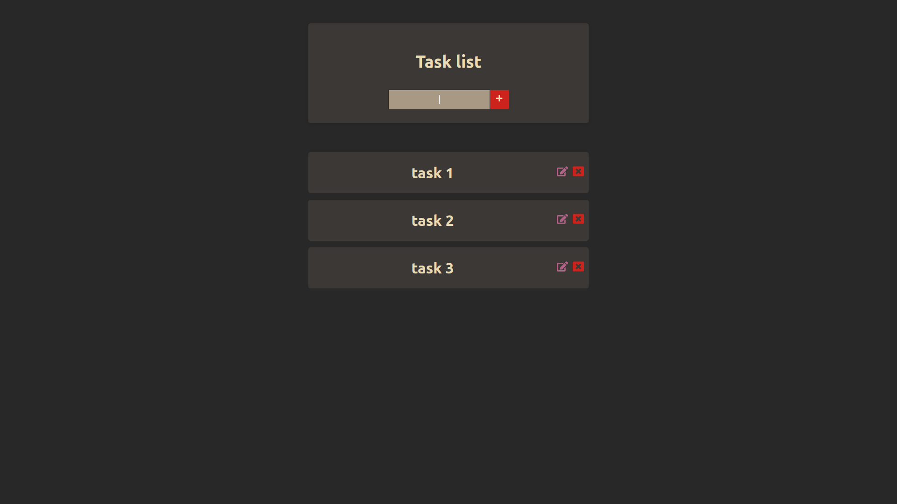

# Todo app
Ordinary todo app i made because i wanted to see what it is like to use classes in react.

## Install and run

```
git clone https://github.com/diegorezm/react-todo-app
cd react-todo-app
npm install
npm run dev
```
